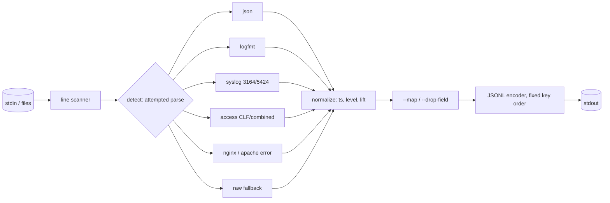

# logvert

[English](README.md) | [中文](README.zh.md) | [日本語](README.ja.md)

[](LICENSE) [](go.mod) [](CHANGELOG.md)  [](CONTRIBUTING.md)

**logvert：logfmt・syslog・Apache/nginx・JSON のログをひとつの正規化 JSONL ストリームへ変換する、オープンソースで依存ゼロのパイプステージ——テスト済みの内蔵パーサとフィールドマッピングにより、混在フォーマットのパイプラインから壊れやすい正規表現設定をなくす。**


```bash
git clone https://github.com/JaydenCJ/logvert && cd logvert
go build -o logvert ./cmd/logvert    # single static binary, stdlib only
```

> プレリリース：v0.1.0 はまだパッケージレジストリにタグ付けされていません。上記の手順でソースからビルドしてください（Go ≥1.22 なら可）。

## なぜ logvert？

現実のシステムが出すログは複数の方言の混合です。自作サービスは logfmt か JSON を書き、sshd や cron は syslog を話し、nginx は Combined アクセスログに加えて独自のエラー形式を書き、そして何かが必ずプレーンテキストで panic します。この混合を今日ひとつのパイプラインへ流し込むには、パーサ設定を書くことになります——Logstash の grok パターン、fluentd/fluent-bit の正規表現パーサ、Vector の VRL remap プログラム——そしてどの設定も、エスケープの書き間違い、キャプチャグループの順序ミス、マッチしない行の静かな喪失を招く新たな機会です。logvert は逆に賭けます。よくあるフォーマットは有限なのだから、それらの本物のパーサを、エッジケース（RFC 5424 構造化データのエスケープ、logfmt のクォート、nginx のコンテキスト接尾辞、`-` フィールド、年を持たない BSD タイムスタンプ）までテストして同梱し、行ごとに自動判定して、1 コマンドで混合ストリーム全体を処理します。これは agent ではなくパイプの一段です。stdin から入り正規化 JSONL が出て、実行のたびにバイト単位で一致し、どのパーサにも合わない行は消えるのではなく `raw` イベントとして通過します。

| | logvert | fluent-bit パーサ | Logstash grok | Vector remap |
|---|---|---|---|---|
| logfmt/syslog/access/error/JSON のテスト済み内蔵パーサ | ✅ | 一部、正規表現ベース | パターン集 | 一部 + VRL コード |
| ひとつのストリーム上で行単位に混合フォーマットを処理 | ✅ 自動判定 | ❌ 入力ごとに 1 パーサ | ❌ 条件分岐 | ❌ 分岐は自分で書く |
| よくあるケースに必要な設定 | なし | 正規表現設定 | grok 設定 | VRL プログラム |
| 実行形態 | パイプステージ | agent デーモン | デーモン（JVM） | agent デーモン |
| パース不能の行 | `raw` として保持 + `--strict` ゲート | 破棄またはタグ付け | `_grokparsefailure` | VRL 内でエラー処理 |
| 決定的でバイト単位に一致する出力 | ✅ | ❌ | ❌ | ❌ |
| ランタイム依存 | 0 | C ランタイム + プラグイン | JVM | 大きなバイナリ |

<sub>2026-07-12 時点の確認：logvert は Go 標準ライブラリのみを import。既定ビルドの fluent-bit は 30+ のプラグインを同梱し、Logstash は JRE を必要とする。</sub>

## 特長

- **正規表現設定ではなく内蔵パーサ** — logfmt（クォート、エスケープ、裸キー）、syslog RFC 5424 + RFC 3164（`<PRI>` の有無、構造化データ、`tag[pid]:`）、Apache/nginx の Common・Combined アクセスログ、両者のエラーログ方言、そして JSON 行。すべてのルールにテストがある。
- **行単位の自動判定** — 判定は覗き見ではなく完全パース：そのフォーマットのパーサが行全体を受理したときだけそのフォーマットと数えるので、交互に混ざった `docker compose logs` のストリームも 1 コマンドで、中途半端なイベントを作らずに変換できる。
- **ひとつの正規化エンベロープ** — `ts`（epoch 数値や年なし BSD 日付を含む任意の方言から RFC 3339 UTC へ）、`level`（テキスト別名・syslog 重大度・数値ログレベル・HTTP ステータスから 6 段階へ）、`msg`、`host`、`app`、`pid`、`source`、`fields`。
- **設定ファイル不要のフィールドマッピング** — `--map severity_text=level` は非標準キーを正規化込みでエンベロープへ持ち上げ、`--map latency=duration_ms` はリネームし、`--drop-field user_agent` はノイズを刈り取る。
- **パースできなかったものに正直** — マッチしない行は原文を抱えた `raw` イベントになる。`--strict` はその存在を終了コード 1 に変え、`--drop-raw` は破棄し、`--stats` は見かけたフォーマットを数える。未知のレベル表記は推測せず `level_raw` として保存する。
- **作りからして決定的** — 固定のエンベロープキー順、ソース順のフィールド、不完全なタイムスタンプ向けの `--assume-tz`/`--assume-year`：同じ入力はバイト単位で同じ出力になり、diff もテストも意味を保つ。
- **agent ではなくパイプステージ** — デーモンなし、リスナーなし、状態なし、テレメトリなし、依存ゼロ。stdin かファイルを読み、stdout へ書いて、終了する。

## クイックスタート

```bash
go build -o logvert ./cmd/logvert
./logvert --assume-year 2026 examples/mixed.log    # 8 lines, 7 formats
```

実際に取得した出力（全 8 行のうち先頭 4 行）：

```text
{"ts":"2026-07-12T10:00:00Z","level":"info","msg":"request served","source":"logfmt","fields":{"status":200,"dur":"15ms"}}
{"ts":"2026-07-12T10:00:01.25Z","level":"warn","msg":"cache miss","app":"api","pid":312,"source":"json","fields":{"key":"user:42"}}
{"ts":"2026-07-12T10:00:02.003Z","level":"fatal","msg":"upstream timed out","host":"web1","app":"nginx","pid":4242,"source":"syslog","fields":{"facility":"auth","msgid":"ID47","origin.ip":"127.0.0.1"}}
{"ts":"2026-07-12T10:00:03Z","msg":"Accepted publickey for deploy from 127.0.0.1 port 51022","host":"web1","app":"sshd","pid":811,"source":"syslog"}
```

非標準プロデューサのキーをエンベロープへ持ち上げる（実出力）：

```bash
echo '{"severity_text":"WARN","svc":"pay","latency":12,"msg":"card charge slow"}' \
  | ./logvert --map severity_text=level --map svc=app --map latency=duration_ms
```

```text
{"level":"warn","msg":"card charge slow","app":"pay","source":"json","fields":{"duration_ms":12}}
```

さらにエンベロープキーはただのトップレベル JSON キーなので、パイプラインに必要なのは grep だけ——`./logvert app.log | grep '"level":"error"'`——そして `--stats` は見たものを報告する：`logvert: 8 lines in — json 1, syslog 2, nginx-error 1, apache-error 1, access 1, logfmt 1, raw 1`。

## 正規化スキーマ

フォーマット別マッピング表を含む完全なリファレンス：[docs/schema.md](docs/schema.md)。

| キー | 出現条件 | 意味 |
|---|---|---|
| `ts` | 行にタイムスタンプがあるとき | RFC 3339 UTC、秒未満は保持 |
| `level` | 認識できたとき | `trace` `debug` `info` `warn` `error` `fatal` |
| `msg` | 常に | メッセージ本文 |
| `host` / `app` / `pid` | 存在するとき | 発生元ホスト、プログラム名、プロセス ID |
| `source` | 常に | マッチしたパーサ：`json` `logfmt` `syslog` `access` `nginx-error` `apache-error` `raw` |
| `fields` | 残りがあるとき | その他の全パース済みフィールド、ソース順（`--flat` でトップレベルへ統合） |

## CLI リファレンス

`logvert [flags] [file ...]` —— ファイル指定がなければ stdin を読む。終了コード：0 正常、1 strict 失敗、2 用法エラー、3 I/O エラー。

| フラグ | 既定値 | 効果 |
|---|---|---|
| `--format` | `auto` | パーサを固定：`json`・`logfmt`・`syslog`・`access`・`nginx-error`・`apache-error`・`raw` |
| `--flat` | オフ | 追加フィールドをトップレベルへ統合（衝突キーは `_` 接頭辞） |
| `--strict` | オフ | 1 行でもパース失敗があれば 1 で終了 |
| `--drop-raw` | オフ | パース不能行を `raw` イベントにせず破棄 |
| `--map` | — | `from=to`：フィールドをリネーム、または `ts`/`level`/`msg`/`host`/`app`/`pid` へ持ち上げ（複数可） |
| `--drop-field` | — | この追加フィールドを全イベントから除去（複数可） |
| `--assume-tz` | `UTC` | タイムゾーンなしのタイムスタンプに適用する zone、例 `+09:00` |
| `--assume-year` | 現在の年 | BSD syslog タイムスタンプに適用する年 |
| `--max-line-bytes` | `1048576` | 受け付ける入力行の最大長 |
| `--stats` | オフ | 終了時にフォーマット別行数を stderr へ出力 |

## 検証

このリポジトリは CI を同梱しません。上記の主張はすべてローカル実行で検証されます：

```bash
go test ./...            # 90 deterministic tests, offline, < 5 s
bash scripts/smoke.sh    # end-to-end CLI check, prints SMOKE OK
```

## アーキテクチャ



## ロードマップ

- [x] v0.1.0 — テスト済みの logfmt/syslog/access/error/JSON パーサ、行単位の自動判定、ts/level 持ち上げ付き正規化エンベロープ、`--map` フィールドマッピング、strict/stats モード、90 テスト + smoke スクリプト
- [ ] 複数行の結合（スタックトレース、Java 例外）をオプトインの前段として
- [ ] 内蔵フォーマットの追加：journald エクスポート形式、HAProxy、PostgreSQL/MySQL サーバログ
- [ ] 下流イベントを軽くする `--select key,key` 出力射影
- [ ] ECS 互換キー名のオプション（`--schema ecs`）
- [ ] Windows イベントテキストと IIS W3C アクセス形式

全リストは [open issues](https://github.com/JaydenCJ/logvert/issues) を参照。

## コントリビュート

Issue・議論・PR を歓迎します——ローカルの作業フロー（フォーマット、vet、テスト、`SMOKE OK`）は [CONTRIBUTING.md](CONTRIBUTING.md) を参照。入門向けタスクは [good first issue](https://github.com/JaydenCJ/logvert/issues?q=is%3Aissue+is%3Aopen+label%3A%22good+first+issue%22) のラベル付き、設計の議論は [Discussions](https://github.com/JaydenCJ/logvert/discussions) へ。

## ライセンス

[MIT](LICENSE)
