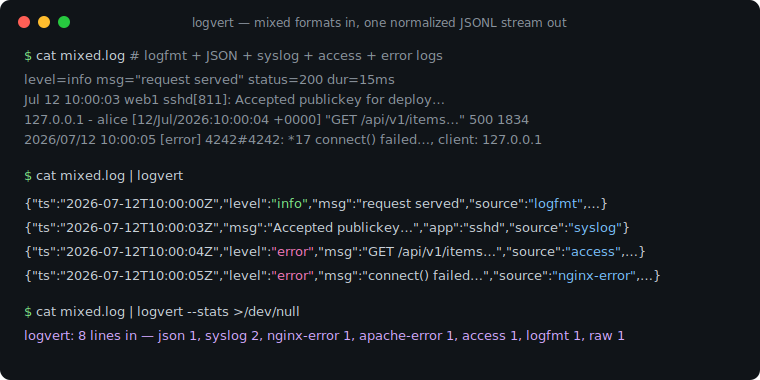
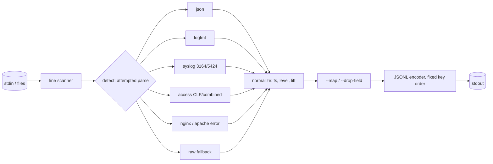

# logvert

[English](README.md) | [中文](README.zh.md) | [日本語](README.ja.md)

[](LICENSE) [](go.mod) [](CHANGELOG.md)  [](CONTRIBUTING.md)

**logvert：an open-source, zero-dependency pipe stage that converts logfmt, syslog, Apache/nginx, and JSON logs into one normalized JSONL stream — built-in tested parsers with field mapping, so mixed-format pipelines stop needing fragile regex configs.**



```bash
git clone https://github.com/JaydenCJ/logvert && cd logvert
go build -o logvert ./cmd/logvert    # single static binary, stdlib only
```

> Pre-release: v0.1.0 is not tagged on a package registry yet; build from source as above (any Go ≥1.22).

## Why logvert?

Every real system emits a mix of log dialects: your services write logfmt or JSON, sshd and cron speak syslog, nginx writes Combined access lines plus its own error format, and something always panics in plain text. Getting that mix into one pipeline today means writing parser configs — grok patterns in Logstash, regex parsers in fluentd/fluent-bit, VRL remap programs in Vector — and every config is a fresh chance to misquote an escape, mis-order a capture group, or silently drop the lines that do not match. logvert takes the opposite bet: the common formats are finite, so ship real parsers for them, tested against the edge cases (RFC 5424 structured-data escapes, logfmt quoting, nginx context suffixes, `-` fields, BSD timestamps with no year), and auto-detect per line so one command handles the whole mixed stream. It is a pipe stage, not an agent: stdin in, normalized JSONL out, byte-identical on every run, and lines nothing matches come through as `raw` events instead of vanishing.

| | logvert | fluent-bit parsers | Logstash grok | Vector remap |
|---|---|---|---|---|
| Built-in tested parsers for logfmt/syslog/access/error/JSON | ✅ | partial, regex-based | pattern library | partial + VRL code |
| Handles mixed formats on one stream, per line | ✅ auto-detect | ❌ one parser per input | ❌ conditionals | ❌ you write the branching |
| Config needed for the common cases | none | regex config | grok config | VRL program |
| Runs as | pipe stage | agent daemon | daemon (JVM) | agent daemon |
| Unparsed lines | kept as `raw` + `--strict` gate | dropped or tagged | `_grokparsefailure` | error handling in VRL |
| Deterministic, byte-identical output | ✅ | ❌ | ❌ | ❌ |
| Runtime dependencies | 0 | C runtime + plugins | JVM | large binary |

<sub>Checked 2026-07-12: logvert imports the Go standard library only; a default fluent-bit build ships 30+ plugins, Logstash requires a JRE.</sub>

## Features

- **Built-in parsers, not regex configs** — logfmt (quoting, escapes, bare keys), syslog RFC 5424 + RFC 3164 (with or without `<PRI>`, structured data, `tag[pid]:`), Apache/nginx Common & Combined access logs, both error-log dialects, and JSON lines. Each rule has a test.
- **Per-line auto-detection** — detection is attempted-parse, not sniffing: a line counts as a format only if its full parser accepts it, so one command converts an interleaved `docker compose logs` stream without half-parsed events.
- **One normalized envelope** — `ts` (RFC 3339 UTC, from any dialect including epoch numbers and year-less BSD dates), `level` (six-value scale from text aliases, syslog severities, numeric logger levels, or HTTP status), `msg`, `host`, `app`, `pid`, `source`, `fields`.
- **Field mapping without a config file** — `--map severity_text=level` lifts nonstandard keys into the envelope with full normalization; `--map latency=duration_ms` renames; `--drop-field user_agent` prunes noise.
- **Honest about what it could not parse** — unmatched lines become `raw` events carrying the original text; `--strict` turns any of them into exit code 1, `--drop-raw` discards them, `--stats` counts every format seen. Unknown level spellings are preserved as `level_raw`, never guessed.
- **Deterministic by construction** — fixed envelope key order, source-order fields, `--assume-tz`/`--assume-year` for under-specified timestamps: identical input is byte-identical output, so diffs and tests stay meaningful.
- **A pipe stage, not an agent** — no daemon, no listener, no state, no telemetry, zero dependencies; reads stdin or files, writes stdout, and exits.

## Quickstart

```bash
go build -o logvert ./cmd/logvert
./logvert --assume-year 2026 examples/mixed.log    # 8 lines, 7 formats
```

Real captured output (first 4 of 8 lines):

```text
{"ts":"2026-07-12T10:00:00Z","level":"info","msg":"request served","source":"logfmt","fields":{"status":200,"dur":"15ms"}}
{"ts":"2026-07-12T10:00:01.25Z","level":"warn","msg":"cache miss","app":"api","pid":312,"source":"json","fields":{"key":"user:42"}}
{"ts":"2026-07-12T10:00:02.003Z","level":"fatal","msg":"upstream timed out","host":"web1","app":"nginx","pid":4242,"source":"syslog","fields":{"facility":"auth","msgid":"ID47","origin.ip":"127.0.0.1"}}
{"ts":"2026-07-12T10:00:03Z","msg":"Accepted publickey for deploy from 127.0.0.1 port 51022","host":"web1","app":"sshd","pid":811,"source":"syslog"}
```

Lift a nonstandard producer's keys into the envelope (real output):

```bash
echo '{"severity_text":"WARN","svc":"pay","latency":12,"msg":"card charge slow"}' \
  | ./logvert --map severity_text=level --map svc=app --map latency=duration_ms
```

```text
{"level":"warn","msg":"card charge slow","app":"pay","source":"json","fields":{"duration_ms":12}}
```

And because the envelope keys are plain top-level JSON, a pipeline needs only grep — `./logvert app.log | grep '"level":"error"'` — while `--stats` prints what it saw: `logvert: 8 lines in — json 1, syslog 2, nginx-error 1, apache-error 1, access 1, logfmt 1, raw 1`.

## The normalized schema

Full reference, including per-format mapping tables: [docs/schema.md](docs/schema.md).

| Key | Present | Meaning |
|---|---|---|
| `ts` | if the line had a timestamp | RFC 3339 UTC, sub-seconds preserved |
| `level` | if recognized | `trace` `debug` `info` `warn` `error` `fatal` |
| `msg` | always | the message text |
| `host` / `app` / `pid` | if present | origin host, program name, process id |
| `source` | always | matching parser: `json` `logfmt` `syslog` `access` `nginx-error` `apache-error` `raw` |
| `fields` | if extras remain | all other parsed fields, in source order (`--flat` merges them top-level) |

## CLI reference

`logvert [flags] [file ...]` — reads stdin when no files are given. Exit codes: 0 ok, 1 strict failure, 2 usage error, 3 I/O error.

| Flag | Default | Effect |
|---|---|---|
| `--format` | `auto` | force one parser: `json`, `logfmt`, `syslog`, `access`, `nginx-error`, `apache-error`, `raw` |
| `--flat` | off | merge extra fields into the top level (collisions get a `_` prefix) |
| `--strict` | off | exit 1 if any line failed to parse |
| `--drop-raw` | off | discard unparseable lines instead of emitting `raw` events |
| `--map` | — | `from=to`: rename a field, or lift it into `ts`/`level`/`msg`/`host`/`app`/`pid` (repeatable) |
| `--drop-field` | — | remove this extra field from every event (repeatable) |
| `--assume-tz` | `UTC` | zone for zone-less timestamps, e.g. `+09:00` |
| `--assume-year` | current year | year for BSD syslog timestamps |
| `--max-line-bytes` | `1048576` | longest accepted input line |
| `--stats` | off | per-format line counts on stderr when done |

## Verification

This repository ships no CI; every claim above is verified by local runs:

```bash
go test ./...            # 90 deterministic tests, offline, < 5 s
bash scripts/smoke.sh    # end-to-end CLI check, prints SMOKE OK
```

## Architecture



## Roadmap

- [x] v0.1.0 — tested parsers for logfmt/syslog/access/error/JSON, per-line auto-detection, normalized envelope with ts/level lifting, `--map` field mapping, strict/stats modes, 90 tests + smoke script
- [ ] Multiline joining (stack traces, Java exceptions) as an opt-in pre-stage
- [ ] More built-ins: journald export format, HAProxy, PostgreSQL/MySQL server logs
- [ ] `--select key,key` output projection for slimmer downstream events
- [ ] Optional ECS-compatible key naming (`--schema ecs`)
- [ ] Windows event-text and IIS W3C access format

See the [open issues](https://github.com/JaydenCJ/logvert/issues) for the full list.

## Contributing

Issues, discussions and pull requests are welcome — see [CONTRIBUTING.md](CONTRIBUTING.md) for the local workflow (format, vet, tests, `SMOKE OK`). Good entry points are labelled [good first issue](https://github.com/JaydenCJ/logvert/issues?q=is%3Aissue+is%3Aopen+label%3A%22good+first+issue%22), and design questions live in [Discussions](https://github.com/JaydenCJ/logvert/discussions).

## License

[MIT](LICENSE)
