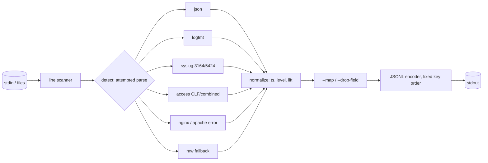

# logvert

[English](README.md) | [中文](README.zh.md) | [日本語](README.ja.md)

[](LICENSE) [](go.mod) [](CHANGELOG.md)  [](CONTRIBUTING.md)

**logvert：开源、零依赖的管道级工具，把 logfmt、syslog、Apache/nginx 与 JSON 日志转换成统一的归一化 JSONL 流——内置经过测试的解析器和字段映射，让混合格式的日志管道不再依赖脆弱的正则配置。**


```bash
git clone https://github.com/JaydenCJ/logvert && cd logvert
go build -o logvert ./cmd/logvert    # single static binary, stdlib only
```

> 预发布：v0.1.0 尚未在任何包仓库打标签；请按上述方式从源码构建（任意 Go ≥1.22）。

## 为什么选 logvert？

每个真实系统输出的日志都是多种方言的混合：你的服务写 logfmt 或 JSON，sshd 和 cron 讲 syslog，nginx 写 Combined 访问日志外加自己的错误格式，还总有东西用纯文本 panic。今天要把这团混合日志送进同一条管道，就得写解析配置——Logstash 的 grok 模式、fluentd/fluent-bit 的正则解析器、Vector 的 VRL remap 程序——而每份配置都是一次新的机会：转义写错、捕获组顺序颠倒、或者悄悄丢掉不匹配的行。logvert 押的是相反的注：常见格式是有限的，那就为它们发布真正的解析器，针对各种边角情况充分测试（RFC 5424 结构化数据转义、logfmt 引号、nginx 上下文后缀、`-` 字段、没有年份的 BSD 时间戳），并逐行自动检测，让一条命令处理整个混合流。它是管道的一级，而不是 agent：stdin 进、归一化 JSONL 出，每次运行字节级一致，无法匹配的行以 `raw` 事件原样通过而不是凭空消失。

| | logvert | fluent-bit 解析器 | Logstash grok | Vector remap |
|---|---|---|---|---|
| 为 logfmt/syslog/access/error/JSON 内置经测试的解析器 | ✅ | 部分，基于正则 | 模式库 | 部分 + VRL 代码 |
| 同一条流上逐行处理混合格式 | ✅ 自动检测 | ❌ 每个输入一个解析器 | ❌ 条件分支 | ❌ 分支逻辑自己写 |
| 常见场景所需的配置 | 无 | 正则配置 | grok 配置 | VRL 程序 |
| 运行形态 | 管道级 | agent 守护进程 | 守护进程（JVM） | agent 守护进程 |
| 解析失败的行 | 保留为 `raw` + `--strict` 把关 | 丢弃或打标签 | `_grokparsefailure` | VRL 里自行处理错误 |
| 确定性、字节级一致的输出 | ✅ | ❌ | ❌ | ❌ |
| 运行时依赖 | 0 | C 运行时 + 插件 | JVM | 大体积二进制 |

<sub>核对于 2026-07-12：logvert 只导入 Go 标准库；默认构建的 fluent-bit 携带 30+ 插件，Logstash 需要 JRE。</sub>

## 特性

- **内置解析器而非正则配置** — logfmt（引号、转义、裸键）、syslog RFC 5424 + RFC 3164（带或不带 `<PRI>`、结构化数据、`tag[pid]:`）、Apache/nginx 的 Common 与 Combined 访问日志、两种错误日志方言，以及 JSON 行。每条规则都有测试。
- **逐行自动检测** — 检测靠的是完整解析而非嗅探：只有该格式的完整解析器接受这一行，它才算这种格式，所以一条命令就能转换交错的 `docker compose logs` 流，绝不产生半解析事件。
- **统一的归一化信封** — `ts`（RFC 3339 UTC，来自任何方言，包括 epoch 数字和无年份的 BSD 日期）、`level`（六级刻度，来自文本别名、syslog 严重度、数字日志级别或 HTTP 状态码）、`msg`、`host`、`app`、`pid`、`source`、`fields`。
- **无需配置文件的字段映射** — `--map severity_text=level` 把非标准键提升进信封并完整归一化；`--map latency=duration_ms` 重命名；`--drop-field user_agent` 修剪噪音。
- **对解析不了的内容保持诚实** — 未匹配的行成为携带原文的 `raw` 事件；`--strict` 让任何此类行返回退出码 1，`--drop-raw` 丢弃它们，`--stats` 统计见到的每种格式。无法识别的级别拼写保留为 `level_raw`，绝不瞎猜。
- **构造上的确定性** — 固定的信封键序、按源顺序排列的字段、为欠定时间戳准备的 `--assume-tz`/`--assume-year`：相同输入产生字节级相同的输出，diff 和测试始终有意义。
- **管道级工具，不是 agent** — 没有守护进程、没有监听端口、没有状态、没有遥测、零依赖；读 stdin 或文件，写 stdout，然后退出。

## 快速上手

```bash
go build -o logvert ./cmd/logvert
./logvert --assume-year 2026 examples/mixed.log    # 8 lines, 7 formats
```

真实捕获的输出（8 行中的前 4 行）：

```text
{"ts":"2026-07-12T10:00:00Z","level":"info","msg":"request served","source":"logfmt","fields":{"status":200,"dur":"15ms"}}
{"ts":"2026-07-12T10:00:01.25Z","level":"warn","msg":"cache miss","app":"api","pid":312,"source":"json","fields":{"key":"user:42"}}
{"ts":"2026-07-12T10:00:02.003Z","level":"fatal","msg":"upstream timed out","host":"web1","app":"nginx","pid":4242,"source":"syslog","fields":{"facility":"auth","msgid":"ID47","origin.ip":"127.0.0.1"}}
{"ts":"2026-07-12T10:00:03Z","msg":"Accepted publickey for deploy from 127.0.0.1 port 51022","host":"web1","app":"sshd","pid":811,"source":"syslog"}
```

把非标准生产者的键提升进信封（真实输出）：

```bash
echo '{"severity_text":"WARN","svc":"pay","latency":12,"msg":"card charge slow"}' \
  | ./logvert --map severity_text=level --map svc=app --map latency=duration_ms
```

```text
{"level":"warn","msg":"card charge slow","app":"pay","source":"json","fields":{"duration_ms":12}}
```

而且由于信封键就是普通的顶层 JSON 键，管道只需要 grep——`./logvert app.log | grep '"level":"error"'`——同时 `--stats` 会打印它看到了什么：`logvert: 8 lines in — json 1, syslog 2, nginx-error 1, apache-error 1, access 1, logfmt 1, raw 1`。

## 归一化 schema

完整参考（含各格式的映射表）：[docs/schema.md](docs/schema.md)。

| 键 | 出现条件 | 含义 |
|---|---|---|
| `ts` | 该行带有时间戳时 | RFC 3339 UTC，保留亚秒精度 |
| `level` | 可识别时 | `trace` `debug` `info` `warn` `error` `fatal` |
| `msg` | 总是 | 消息正文 |
| `host` / `app` / `pid` | 存在时 | 来源主机、程序名、进程号 |
| `source` | 总是 | 命中的解析器：`json` `logfmt` `syslog` `access` `nginx-error` `apache-error` `raw` |
| `fields` | 有剩余字段时 | 其余全部解析字段，按源顺序（`--flat` 将其合并到顶层） |

## CLI 参考

`logvert [flags] [file ...]` —— 未给文件时读取 stdin。退出码：0 正常，1 strict 失败，2 用法错误，3 I/O 错误。

| 标志 | 默认值 | 效果 |
|---|---|---|
| `--format` | `auto` | 强制单一解析器：`json`、`logfmt`、`syslog`、`access`、`nginx-error`、`apache-error`、`raw` |
| `--flat` | 关 | 把额外字段合并到顶层（冲突键加 `_` 前缀） |
| `--strict` | 关 | 任何一行解析失败即以 1 退出 |
| `--drop-raw` | 关 | 丢弃无法解析的行，而不是输出 `raw` 事件 |
| `--map` | — | `from=to`：重命名字段，或提升进 `ts`/`level`/`msg`/`host`/`app`/`pid`（可重复） |
| `--drop-field` | — | 从每个事件中移除该额外字段（可重复） |
| `--assume-tz` | `UTC` | 无时区时间戳所用的时区，例如 `+09:00` |
| `--assume-year` | 当前年份 | BSD syslog 时间戳所用的年份 |
| `--max-line-bytes` | `1048576` | 接受的最长输入行 |
| `--stats` | 关 | 结束时在 stderr 打印各格式行数 |

## 验证

本仓库不携带 CI；上述所有断言均由本地运行验证：

```bash
go test ./...            # 90 deterministic tests, offline, < 5 s
bash scripts/smoke.sh    # end-to-end CLI check, prints SMOKE OK
```

## 架构



## 路线图

- [x] v0.1.0 — 经测试的 logfmt/syslog/access/error/JSON 解析器、逐行自动检测、带 ts/level 提升的归一化信封、`--map` 字段映射、strict/stats 模式、90 个测试 + smoke 脚本
- [ ] 多行合并（堆栈跟踪、Java 异常）作为可选的前置阶段
- [ ] 更多内置格式：journald 导出格式、HAProxy、PostgreSQL/MySQL 服务器日志
- [ ] `--select key,key` 输出投影，给下游更精简的事件
- [ ] 可选的 ECS 兼容键名（`--schema ecs`）
- [ ] Windows 事件文本与 IIS W3C 访问格式

完整列表见 [open issues](https://github.com/JaydenCJ/logvert/issues)。

## 贡献

欢迎 issue、讨论与 PR——本地工作流（格式化、vet、测试、`SMOKE OK`）见 [CONTRIBUTING.md](CONTRIBUTING.md)。入门任务标注为 [good first issue](https://github.com/JaydenCJ/logvert/issues?q=is%3Aissue+is%3Aopen+label%3A%22good+first+issue%22)，设计讨论在 [Discussions](https://github.com/JaydenCJ/logvert/discussions)。

## 许可证

[MIT](LICENSE)
